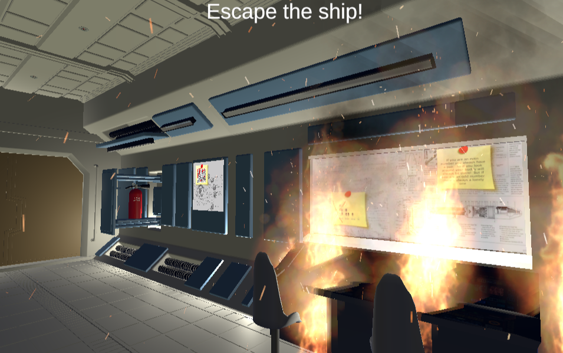
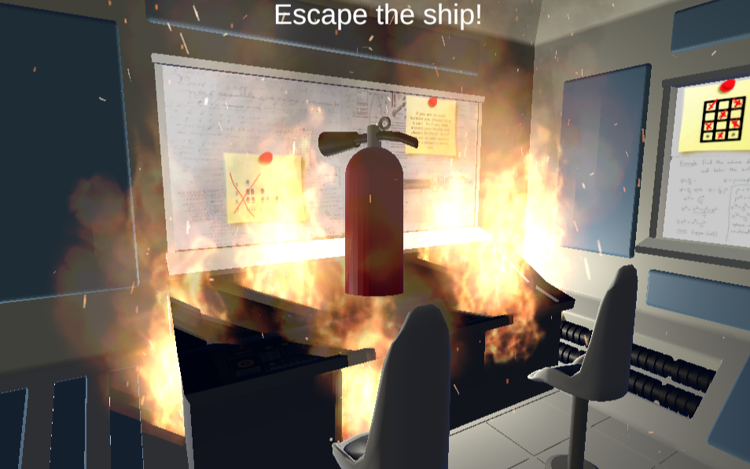
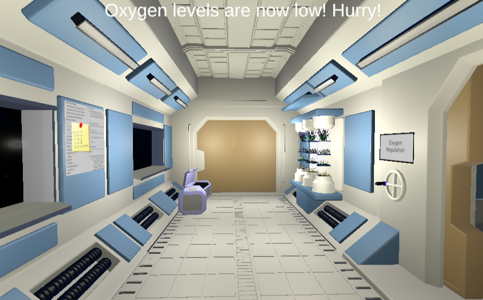
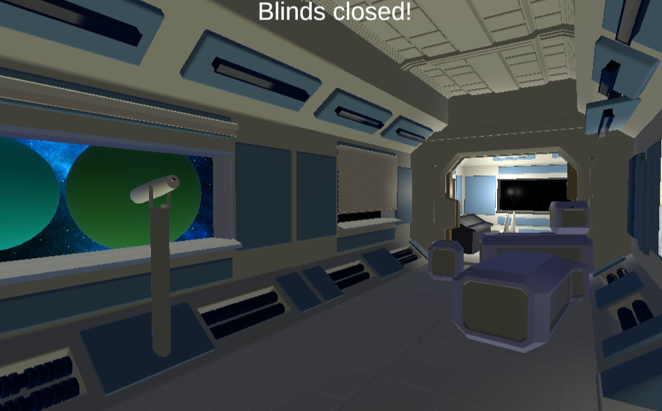
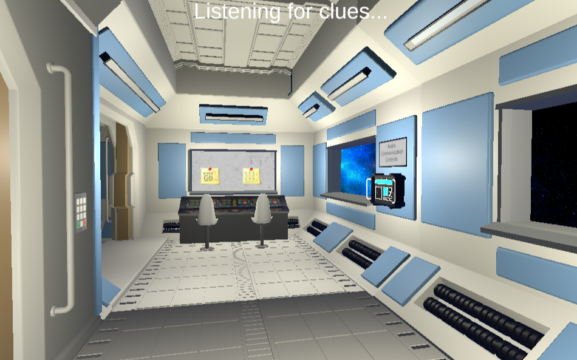
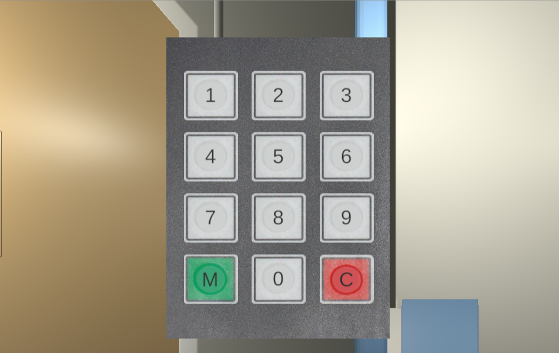
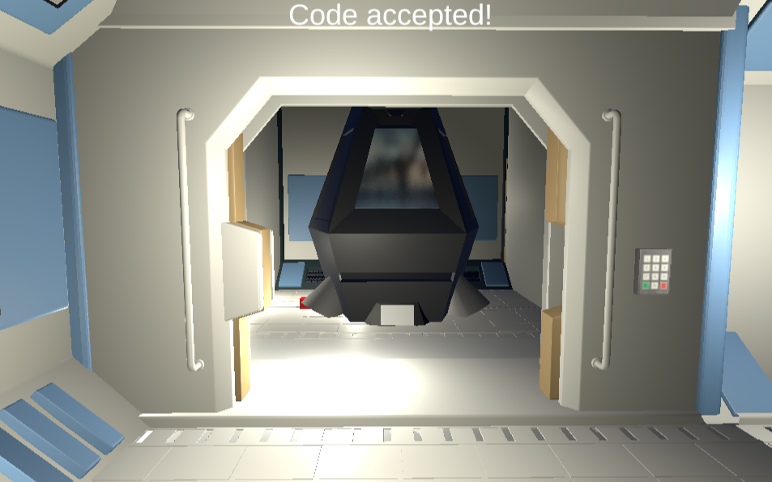

# Space Escape - 3D WebGL Unity Game
**Final Project for LMC 2730 at Georgia Tech**
**By: Katie Carlson, Nathan Davenport, Nahiza Haque, Kelsey Sheridan**

For our final class project, our group of four designed an
interactive prototype of an escape game that takes place in space.
We decided to take the prompt of “tech” in the direction of an
advanced space technology theme and implemented that within
both the design atmosphere and the narrative story-line. We
divided the work among our strengths and weaknesses and
collaborated to bring to life our vision of what it might be like to
escape a spaceship full of failing technology.

For further background: [Process Esssay](https://8fdb2b80-0634-45aa-98b8-cfecd4f6659f.filesusr.com/ugd/9cda48_996eb8a907b34128bba1e1f2afacf9ff.pdf)

# Screenshots

# Video Demonstration

# Playable game
https://nathandaven.com/works/space-escape/

# Website
https://nahizahaque.wixsite.com/space-escape/files

# Source files
https://drive.google.com/drive/folders/1_kgUTm4Lrtne1-PfH0t2fwKlhhWhXJyI

